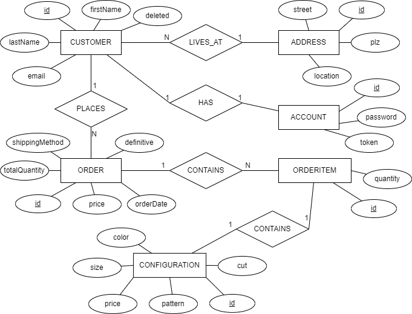
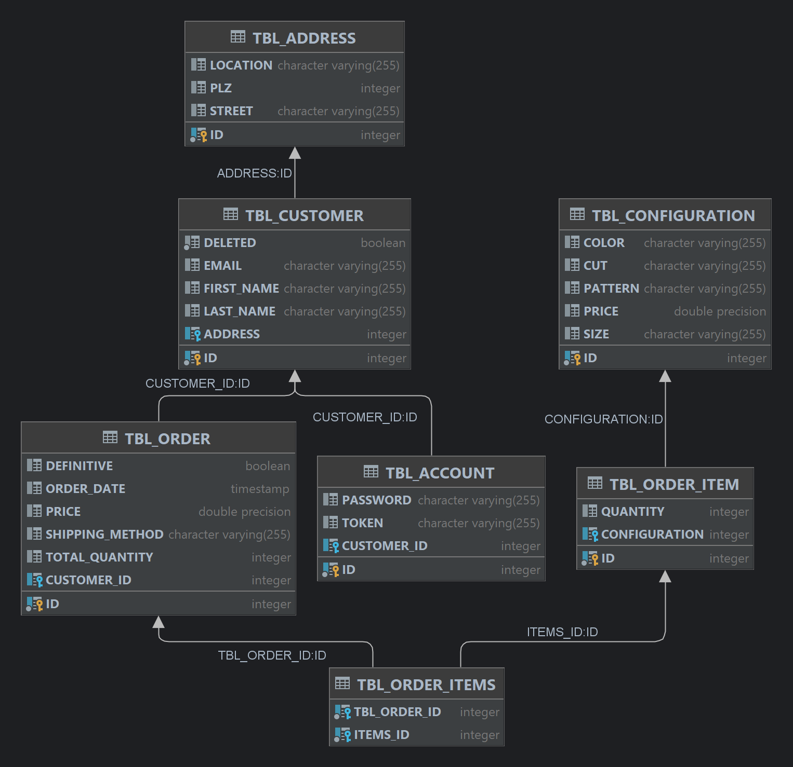

## Projektinformationen

**Aufgabe:** Entwicklung einer rudimentären Web-Applikation  
**Ziel:** Die im Unterricht behandelten Konzepte praktisch einsetzen  
**Gruppe:** Amsler Marco, Fankhauser Stefan, Frey Fabio, Karaqi Margareta, Läubin Joel, Wadhawan Elia

***

## Zielsetzung/Szenario

- Entwicklung eines T-Shirt-Konfigurators
- Kunde kann ein T-Shirt nach bestimmten Attributen konfigurieren und bestellen

***

## Datenmodell

### ER-Modell

### ER-Diagramm (aus IntelliJ)

### Relationales Modell

- **Address** (<u>id</u>, street, plz, location)
- **Customer** (<u>id</u>, firstName, lastName, email,
  deleted, <u style="border-bottom: 1px dotted; text-decoration: none;">fk_address</u>)
- **Configuration** (<u>id</u>, cut, color, size, pattern, price)
    - cut (enum): Round, VNeck, Polo
    - color (enum): White, Black, Red, Blue, Green
    - size (enum): Small, Medium, Large
    - pattern (enum): Plain, Striped
- **Order** (<u>id</u>, <u style="border-bottom: 1px dotted; text-decoration: none;">fk_customer</u>, totalQuantity,
  shippingMethod, price, orderDate, definitive)
    - shippingMethod (enum): Economy, Priority, Express
- **OrderItem** (<u>id</u>, <u style="border-bottom: 1px dotted; text-decoration: none;">fk_configuration</u>, quantity)
- **OrderItems** (<u><u style="border-bottom: 1px dotted; text-decoration: none;">
  fk_order</u>, <u style="border-bottom: 1px dotted; text-decoration: none;">fk_orderItem</u></u>)
- **Account** (<u>id</u>, <u style="border-bottom: 1px dotted; text-decoration: none;">fk_customer</u>, password, token)

***

## Funktionen

### Presentation Layer

Grundsätzlicher Aufbau:

- **Navigationsleiste** (*navbar*) mit Logo und drei Buttons (*Home*, *Contact*, *Login*)
    - *Contact*: zeigt Landingpage mit Kontaktangaben des Unternehmens sowie einem Kontaktformular an
    - *Home*: zeigt wieder die Homepage an
    - *Login*: öffnet ein Popup für Login und Registrierung
        - Login: um sich mit einem bestehenden Kundenkonto anzumelden
            - nach einem erfolgreichen Login erscheinen die beiden Buttons *Logout* (um auszuloggen) und *Order
              History* (um Bestellhistorie anzuzeigen)
        - Registrierung: um ein neues Kundenkonto zu erstellen
- **Hauptframe** (*container*) mit zwei Spalten: T-Shirt-Anzeige (*preview-column*) und Bedienfeld (*control-column*)
    - **T-Shirt-Anzeige**: enthält ein Karussell (*carousel slide*) mit den verschiedenen T-Shirt-Ansichten
    - **Bedienfeld**: wechselt per Knopfdruck zwischen *configuration-panel*, *order-panel* und *aftersales-panel*
        - *configuration-panel*: Panel für T-Shirt-Konfiguration, Warenkorb und Checkout
        - *order-panel*: Panel für Kundendaten
        - *aftersales-panel*: Panel für Bestellbestätigung
- **Footer** mit "Why choose ShirtCreator?", Social Media Icons (noch ohne Funktionalität) und Copyright
- Das Sign-Up für den *Newsletter* sowie das *Kontaktformular* haben aus Scope-Gründen noch keine Funktionalität.

### Service Layer

- **OrderService:**
    - Bestellung erstellen (*createOrder*):
        - HTTP-Method: POST
        - Path: http://localhost:8080/api/order/
        - Parameters: None
        - Request Body: MessageNewOrder (customerId, orderDate) - JSON
            - Example: {"customerId": 1, "orderDate": "2023-01-08"}
        - Response: orderId - JSON
    - Bestellung abfragen (*getOrder*):
        - HTTP-Method: GET
        - Path: http://localhost:8080/api/order/{orderId}
        - Parameters: None
        - Request Body: None
        - Response: MessageOrderDetails - JSON
            - MessageOrderDetails (orderId, customerId, totalQuantity, orderDate, shippingMethod, price, items (
              configuration (id, cut, color, size, pattern, price), orderItemId, quantity))
    - Bestellungen von Kunden abfragen (*getOrdersForCustomer*):
        - HTTP-Method: GET
        - Path: http://localhost:8080/api/orders
        - Parameters: customerId - Integer
            - Example: http://localhost:8080/api/orders?customerId=1
        - Request Body: None
        - Response: List<MessageOrderShort> - JSON
            - MessageOrderShort (orderId, customerId, totalQuantity, orderDate, shippingMethod, price)
    - Bestellung aktualisieren (*updateOrder*):
        - HTTP-Method: PUT
        - Path: http://localhost:8080/api/order/{orderId}
        - Parameters: None
        - Request Body: MessageUpdateOrder (customerId, orderDate, definitive) - JSON
            - Example: {"customerId": 1, "orderDate": "2023-01-07", "definitive": "false"}
        - Response: boolean - JSON
    - Versandbedingung aktualisieren (*updateShippingMethod*):
        - HTTP-Method: PUT
        - Path: http://localhost:8080/api/order/{orderId}/updateShippingMethod/{shippingMethod}
            - Example: http://localhost:8080/api/order/1/updateShippingMethod/Express
        - Parameters: None
        - Request Body: None
        - Response: boolean - JSON
    - Artikel zu einer Bestellung hinzufügen (*addItemToOrder*):
        - HTTP-Method: PUT
        - Path: http://localhost:8080/api/order/{orderId}/addItem
        - Parameters: None
        - Request Body: MessageAddItemToOrder (quantity, configurationId) - JSON
            - Example: {"quantity": 15, "configurationId": 25}
        - Response: orderItemId - JSON
    - Artikel von einer Bestellung löschen (*deleteItemFromOrder*):
        - HTTP-Method: PUT
        - Path: http://localhost:8080/api/order/{orderId}/deleteItem/{itemId}
        - Parameters: None
        - Request Body: None
        - Response: orderItemId - JSON
    - Preis einer Bestellung abfragen (*getOrderPrice*):
        - HTTP-Method: GET
        - Path: http://localhost:8080/api/order/{orderId}/getPrice
        - Parameters: None
        - Request Body: None
        - Response: orderPrice - JSON
- **ConfigurationService:**
    - Konfiguration abfragen (*getConfiguration*):
        - HTTP-Method: GET
        - Path: http://localhost:8080/api/configuration
        - Parameters: cut, pattern, size, color - String
            - Example: http://localhost:8080/api/configuration?cut=Polo&pattern=Striped&size=Large&color=Green
        - Request Body: None
        - Response: Configuration (id, cut, color, size, pattern, price) - JSON
- **CustomerService:**
    - Kunde erstellen (*createCustomer*):
        - HTTP-Method: POST
        - Path: http://localhost:8080/api/customer/
        - Parameters: None
        - Request Body: MessageNewCustomer (firstName, lastName, email, address (street, plz, location)) - JSON
            - Example: {"firstName": "Stefan", "lastName": "Fankhauser", "email": "stefan.fankhauser@students.fhnw.ch",
              "address": {"street": "Rütistrasse 1", "plz": 5400, "location": "Baden"}}
        - Response: Customer (id, firstName, lastName, email, deleted, address (street, plz, location)) - JSON
    - Kunde abfragen (*getCustomer*):
        - HTTP-Method: GET
        - Path: http://localhost:8080/api/customer/{id}
        - Parameters: None
        - Request Body: None
        - Response: Customer (id, firstName, lastName, email, deleted, address (street, plz, location))- JSON
    - Kunde aktualisieren (*updateCustomer*):
        - HTTP-Method: PUT
        - Path: http://localhost:8080/api/customer/{id}
        - Parameters: None
        - Request Body: MessageNewCustomer (firstName, lastName, email, address (street, plz, location)) - JSON
            - Example: siehe *Kunde erstellen*
        - Response: boolean - JSON
- **AccountService:**
    - Konto erstellen (*createAccount*):
        - HTTP-Methode: POST
        - Path: http://localhost:8080/api/account/
        - Parameters: None
        - Request Body: MessageNewAccount (firstName, lastName, street, plz, location, eMail, password) - JSON
            - Example: {"firstName": "Stefan", "lastName": "Fankhauser", "street": "Rütistrasse 1", "plz": 5400, "
              location": "Baden", "eMail": "stefan.fankhauser@students.fhnw.ch", "password": "password"}
        - Response: Account (customer (id, firstName, lastName, email, deleted, address (street, plz, location)),
          password, token, id) - JSON
    - Konto abfragen (*getAccount*):
        - HTTP-Method: GET
        - Path: http://localhost:8080/api/account/{token}
        - Parameters: None
        - Request Body: None
        - Response: Account (siehe *Konto erstellen*) - JSON
    - Konto anmelden (*login*):
        - HTTP-Methode: PUT
        - Path: http://localhost:8080/api/account/login
        - Parameters: None
        - Request Body: MessageLogin (eMail, password) - JSON
            - Example: {"eMail": "stefan.fankhauser@students.fhnw.ch", "password": "password"}
        - Response: MessageToken (token) - JSON
    - Konto abmelden (*logout*):
        - HTTP-Method: PUT
        - Path: http://localhost:8080/api/account/logout
        - Parameters: None
        - Request Body: MessageToken (token) - JSON
        - Response: String - JSON

### Business Logic Layer

- **ConfigurationVerification:**
    - *calculateConfigurationPrice*:
        - nimmt eine Konfiguration entgegen und berechnet ihren Preis
        - gibt den Preis als Double zurück
- **OrderVerification:**
    - *validateOrder*:
        - nimmt eine Bestellung entgegen und prüft die maximale T-Shirt-Anzahl
        - gibt entsprechend true (bei Anzahl < MAX_QUANTITY) oder false (bei Anzahl > MAX_QUANTITY)
    - *calculateOrderPrice*:
        - nimmt eine Bestellung entgegen und berechnet ihren Preis
        - ruft *calculateShippingCosts* auf
        - gibt den Preis als Double zurück
    - *calculateShippingCosts*:
        - nimmt eine Bestellung entgegen und berechnet ihre Versandkosten
        - gibt die Kosten als Double zurück
- **CustomerVerification:**
    - *validateEmailAddress*:
        - nimmt eine E-Mail-Adresse als String entgegen und prüft, ob diese valide ist
        - gibt entsprechend true oder false zurück
    - auf Validierung PLZ wurde aus Scope-Gründen verzichtet
- **AccountVerification**:
    - *generateLoginToken*:
        - generiert bei einem Login einen neuen Token
        - gibt Token als String zurück
    - *validatePassword*:
        - nimmt ein Passwort als String entgegen und prüft, ob dieses mindestens 8 Zeichen lang ist
        - gibt entsprechend true oder false zurück

### Persistence Layer

- Für jede Entität wurde ein entsprechendes Repository erstellt.
- Die Entitäten wurden mit den nötigen Annotationen versehen.
- Das Datenmodell wurde gemäss Abschnitt "Datenmodell" umgesetzt.
- Bezüglich Datenhaltung haben wir uns für die eingebettete DB **H2** entschieden.

***

## Reflexion

Ziel der Projektarbeit war es, die im Unterricht behandelten Konzepte (HTML, CSS, JavaScript, Layer-Architektur,
REST-Services) zu vertiefen und praktisch umzusetzen. Da Server-seitig eine Java App mit DB-Zugriff implementiert werden
sollte, kamen neben den Inhalten des Moduls "Internettechnologien" auch noch Aspekte aus "Programmierung", "Software
Engineering" und "Datenbanken" zum Tragen. Dieses Projekt diente also auch gleichzeitig dem Aufarbeiten und Repetieren
von Unterrichtsstoff aus früheren Modulen.

Wir konnten uns bereits im ersten Team-Meeting auf den **T-Shirt-Konfigurator** und die grundlegende Konzeption einigen.
Von Vornherein war klar, dass wir die Entitäten *Order*, *Customer* und *Configuration* benötigen, wobei eine
Configuration als eine festgelegte Kombination von T-Shirt-Attributen (Schnitt, Farbe, Grösse, Muster) zu verstehen ist.
Der Bestellvorgang sollte in einem ersten Wurf relativ einfach gehalten werden:

1. Farbe, Schnitt, Grösse und Muster wählen
2. Menge und Versandbedingung wählen
3. Kundendaten eingeben
4. Bestellung abschicken
5. Information "Vielen Dank für die Bestellung" anzeigen

Noch im gleichen Meeting wurden die benötigten Entitätsattribute und REST-Services definiert. Nach und nach kamen
dann weitere Ideen und somit auch zusätzliche Entitäten (bspw. Address, OrderItem, Account) und Services (bspw.
getPrice, createAccount, login, etc.) dazu. Wir trafen uns einmal wöchentlich, um das weitere Vorgehen zu besprechen,
neue Tasks zu definieren, bestehende Probleme anzusprechen sowie bisher Gemachtes zu präsentieren. Nach den Meetings
gaben wir uns jeweils eine Woche Zeit, um die neuen Tasks abzuarbeiten.

Für die Arbeit haben wir folgende Applikationen/Frameworks eingesetzt:

- **IntelliJ:** Programmierumgebung
- **GitHub:** Versionsverwaltung (Remote Repository)
- **Azure DevOps:** zur Prozessunterstützung (Tasks zusammentragen, zuweisen, etc.)
- **Bootstrap:** als Frontend Toolkit
- **Photoshop:** zur Gestaltung der T-Shirts
- **diagrams.net:** zur Erstellung des ER-Modells

Schwierigkeiten hatten wir insofern, als bei der Erstellung eines Projekts mit sechs Personen die inhaltliche Abstimmung
durchaus seine Tücken haben kann. Es gab keinen "Product Owner", welcher den Gesamtüberblick hatte und den Code
inhaltlich laufend verifiziert hat. Somit mussten beispielsweise bestehende Services überarbeitet oder wieder gelöscht
werden, die Entitäten um weitere, fehlende Attribute ergänzt werden und die Projektstruktur angepasst werden. Des
Weiteren war für uns anfangs nicht klar, was alles in die Businesslogik gehört und wie wir diese konkret umsetzen
möchten. Schlussendlich haben wir nicht nur Evaluations-, sondern auch Preis-spezifische Dinge in der Businesslogik
realisiert. Auch die Arbeit mit Bootstrap stellte uns vor Herausforderungen, da dieses Rahmenwerk nicht den gleichen
Ansatz verfolgt wie die Grundanforderungen aus den Vorlesungen.

Wir sind uns durchaus bewusst, dass wir einige Dinge (noch) nicht abfangen (bspw. Veränderung der Userdaten eines
bestehenden Accounts; Kontaktformular, Newsletter und Social-Media-Buttons ohne Funktionalität; Löschen eines
Accounts/Customers, etc.). Dies hätte den Scope des Projekts überschritten.

Alles in allem war dies ein sehr aufschlussreiches Projekt, in welchem viele im Unterricht behandelten Aspekte
zusammenkamen. Es war spannend zu sehen, wie diese Aspekte zusammenwirken und was es alles braucht, um eine
funktionierende Web-Applikation zu entwickeln. Die Zusammenarbeit im Team klappte gut und die eingesetzten
Applikationen/Frameworks erwiesen sich als sehr hilfreich.